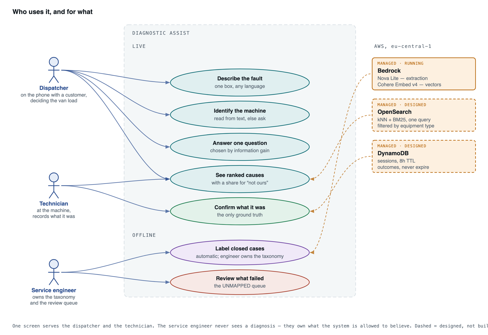
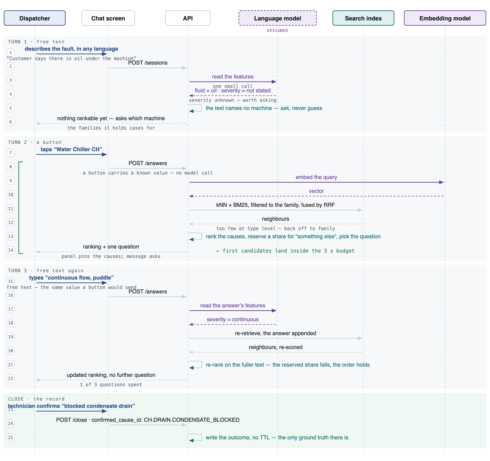
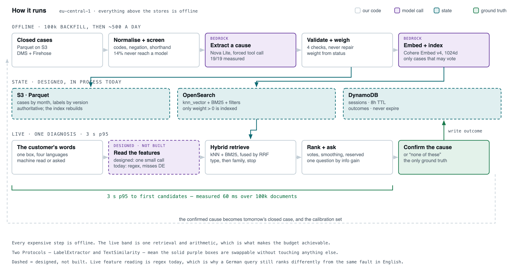

# Diagnostic Assist

22 closed field-service cases, four languages, **no root-cause field anywhere in the data**.
A dispatcher types what is wrong; the system returns ranked root causes with a probability
each, and an explicit share reserved for a cause it does not have.

This README is the submission, in the order the brief asks for it. Every result here is
output from running the code, each with a script under `backend/scripts/` that reproduces
it; anything projected to a hundred thousand cases and beyond is labelled as a projection.

Full-size diagrams are in [`diagrams/`](diagrams/) as SVG and 2400px PNG.

---

## Before the five: the hard part

Nobody has ever labelled this corpus. So whatever assigns root causes both **creates the
training data** and is the one component **nothing downstream can contradict**. If it is
wrong, retrieval searches a wrong index and the probabilities are confident numbers about
nothing — silently, because there is no ground truth to disagree with them.

Every decision below follows from that.

---

## 1. What the product is

**One screen, two users, one session.** The dispatcher has hearsay on a phone line and acts
on the probability spread and on `typical_parts`, the only field that turns a cause into a
van load. The technician is at the machine and acts on the ordering and the evidence case
ids. Two apps would double the surface that has to stay honest about its uncertainty. A
third user, the service engineer, never sees a diagnosis: they own the taxonomy and the
review queue, which is to say they own what the system is allowed to believe.



| Step | What the screen shows | What the user does |
| --- | --- | --- |
| 1 · describe | One free-text box. No dropdowns — a mechanic in front of a broken machine describes the fault, not the asset record | Types, in any of four languages |
| 2 · scope | If the machine cannot be read out of the text, one question: which machine. Until answered, the ranking is empty rather than global | Taps a family, or keeps typing |
| 3 · rank | Up to 5 causes, a probability each, a row for **"something else"**, and a line saying how thin the evidence was | Reads. Candidates stream before the question does |
| 4 · ask | At most 3 questions, each chosen by how much the answer would change the ranking. Two or three buttons, typing also works | Answers, or ignores them |
| 5 · confirm | The candidates as buttons, plus **"None of these"** | **Presses one.** This is the only ground truth the running system ever produces |

The machine question does not count against the three: the three are for symptoms, and this
is the scope they happen inside. **If nobody presses confirm, the product has no accuracy
number and decays into a search box with decoration.** It is pressed after the machine is
already fixed, so expect a low, self-selected rate — the fix is not a model change, dispatch
has to require the press to close a job.

### C-48712, walked through

| What happens | Why |
| --- | --- |
| Dispatcher types *"Customer says there is oil under the machine"* | Hearsay, third-hand, no machine named |
| System asks which machine → taps **Water Chiller CH** | `equipment.py` declines rather than guesses. Over the 22 descriptions it resolves 12, declines 10, wrong 0 |
| CH-200 has 3 votable cases, under `MIN_TYPE_NEIGHBOURS` 5 → backs off to family, and says so | Below 5, one mislabelled case can swing the ranking alone |
| **Blocked condensate drain** on top, then pump seal, corroded fitting, Schrader leak — **44% reserved for something else** | **The system contradicts the customer.** They said oil; the corpus knows a puddle under a chiller is usually condensate. That is the whole value of matching against history rather than reading the words |
| Asks *"How fast is it coming out?"* → *"continuous flow, puddle"* | Severity is the question worth asking; fluid is not, because the dispatcher already said oil. Answers are appended to the text and everything re-ranks — they never filter |
| Same order, firmer, reserved share falls to **39%** | Nothing new clears the floor, so no second question is asked |
| Technician confirms **blocked condensate drain** | C-48712's own notes: *"No oil leak found. Fluid was condensate from the chiller drain pan, drain line was blocked."* |
| **Same query, that case held out** — the regime section 4 measures. Pump seal on top, and **49% reserved** | **This is the honest half.** With the cause gone from the corpus the system cannot name it, offers only oil causes, and reserves half its probability for something it does not have. A ranker that normalised over its neighbours would have shown a confident pump seal instead |

Both rows are output from running the system. The gap the second exposes: when the
technician presses **"None of these"** they **cannot record the cause they actually found**
— that is the cheaper half of the signal, and the half that would tell us what to add to the
taxonomy is missing. First thing I would add to the UI.



The `Language model` lane is dashed because none of it runs yet: reading features off free
text is the one model call site that is designed and not built. The embedding model beside
it is real.

---

## 2. The design note

### a. The pipeline



The 3 s budget covers only the live band, which is what makes it achievable: every
expensive step happens once per case offline, never once per question. Two Protocols
(`LabelExtractor`, `TextSimilarity`) make the model calls swappable, and the domain has no
vendor import at all. Dashed means designed, not built.

### b. The algorithms, and what each was chosen over

| Stage | Algorithm | Chosen over — and what it costs |
| --- | --- | --- |
| Labelling | Schema-constrained extraction, forced tool call, then 4 rejection rules | **Over supervising on `parts_replaced`**, the only label-shaped field. Measured over the sample, a parts-derived label is right most of the time, produces nothing for a real diagnosis where no part was fitted, and invents one for a warranty swap. Cost: the extractor loses the one structured signal and leans on phone-typed text |
| Retrieval | Cohere Embed v4, 1024d, + BM25 fused by RRF, filtered by equipment type | **Over a lexical index.** The corpus is DE/EN/FR/IT, often mixed in one case, so a language boundary the index cannot cross is most of this business failing. BM25 still earns a place because dense encoders blur `E207` into `E307` and three cases here turn on 207. Cost: RRF returns ranks, not similarities, so the cosine thresholds need re-fitting |
| Ranking | Similarity-weighted vote × evidence weight, Laplace-smoothed | **Over a learned re-ranker**, which would win on NDCG and could not explain itself. A technician is about to disagree with this number; a vote count debugs from three case ids. Cost: that gap is unmeasured |
| Uncertainty | Open-set: reserved mass for a cause outside the taxonomy, growing when retrieval widens | **Over normalising across what was retrieved**, which always sums to 100% and is therefore always wrong about its own coverage. Cost: the largest row is often one nobody can act on |
| Questions | Expected information gain in bits, floor 0.02 | **Over a fixed decision tree.** Cost: on a thin type the estimate is mostly smoothing |
| Taxonomy | Embed resolutions → UMAP → HDBSCAN → engineer names and merges → frozen version | **Over free-form generation**, whose causes never join up. Cost: a fault seen a handful of times in a large corpus lands in clustering noise and gets no cause |
| Calibration | Isotonic per `fallback_level`; Platt under ~1,000 sessions a bucket | Not built — needs outcomes. Until then the number is an ordering, and the screen says so |

### c. The data structures

One indexed record, field by field — this is C-48712 as the pipeline builds it, not an
illustration. In production S3 Parquet is authoritative and the index rebuilds from it;
today both live in process.

```json
{
  "case_id": "C-48712",
  "equipment_family": "Water Chiller CH",
  "equipment_type": "CH-200",
  "language": "en",

  "label": {
    "taxonomy_version": "2026-09-seed",
    "outcome_status": "CONFIRMED",
    "cause_id": "CH.DRAIN.CONDENSATE_BLOCKED",
    "confidence": 0.95,
    "evidence_weight": 1.0,
    "flags": ["NO_PART_FIX", "CUSTOMER_SYMPTOM_MISMATCH"],
    "evidence_spans": [
      "Fluid was condensate from the chiller drain pan, drain line was blocked.",
      "Blocked condensate drain line, cleared."
    ]
  },

  "features": {
    "error_codes": [],
    "error_codes_absent": false,
    "fluid_claimed": "oil",
    "severity": "continuous",
    "recurrence": "unknown",
    "onset_conditions": [],
    "normalized_text": "customer reported puddle of oil under the machine."
  },

  "embedding_ref": {
    "model": "cohere.embed-v4",
    "input_type": "search_document",
    "dims": 1024
  },
  "embedding": [ "1024 floats" ]
}
```

**Family and type are the retrieval scope, not decoration:** the ladder searches the type,
widens to the family, and stops. `language` is recorded and never translated — a case is
evidence, and translating evidence loses the words the match was made on.

**`evidence_weight` comes from `outcome_status`, never from `confidence`** — CONFIRMED 1.0,
PROVISIONAL 0.25, else 0. A confidently labelled warranty swap is still worth nothing, and
in practice the model returns nearly the same confidence every time: a stock answer, not an
estimate. `evidence_spans` must occur in the case text or the label is refused.
`taxonomy_version` is pinned so re-inducing never silently reinterprets labels already
written. `NO_PART_FIX` is here because nothing was replaced — the drain was cleared, and a
parts-derived label would have produced nothing at all for this case.

**`features` derives from `customer_description` only**, because a live session has nothing
else. The field is `fluid_claimed`, not `fluid`: here it says **oil** and the confirmed
cause is a condensate drain, which is why the case also carries `CUSTOMER_SYMPTOM_MISMATCH`
and why the name records who said it. `error_codes_absent` is its own field, because "no
codes shown" is a different fact from nobody mentioning codes, and only one of them rules
causes out.

**The embedding covers the technician text**, which feature extraction must not — that buys
back the recall the line above costs. `input_type` is stored because Cohere trains the two
sides asymmetrically and mixing them costs recall silently; `model` is stored because query
and document vectors must come from one set of weights, and if it ever changes every vector
in the index is stale with nothing else to say so.

**Only `evidence_weight > 0` is indexed** — 19 of 22 here. The other three have real symptom
text and no trustworthy answer, and letting that text into a ranking is the most expensive
mistake available in this system.

**How a new case matches 100,000 old ones:** one OpenSearch round trip — kNN at k=50 with
`ef_search` 100 on the embedding, plus BM25 over normalised text and a terms clause on
`error_codes`, both under an `equipment_type` filter, fused by RRF at k=60, keeping 25, on
OpenSearch's conventional defaults. If a type yields under 5 neighbours it re-issues at
family level and stops there — never global, because every cause outside the family is one
the machine cannot have and the ranker drops it anyway. Today it is an in-process scan,
**O(corpus) per call**, which is the one part of the live path that does not survive real
volume.

### d. The processing

| | How | Cost |
| --- | --- | --- |
| **100k backfill** | Glue writes one JSONL record per case to S3, each `modelInput` from `build_prompt` — the same function the live path uses, so the two cannot drift. Step Functions Maps over shards on `CreateModelInvocationJob`, polling on a Wait loop. A second Glue job joins by `recordId`, validates, writes the labels partition; parse failures go to a dead-letter prefix, **never dropped** — a systematic parse failure looks exactly like a systematic absence of that cause. Then embed, bulk-index, flip the alias | tens of dollars of tokens, and an overnight run — queue-bound |
| **~500 / day** | EventBridge → SQS → Lambda calling the same extractor. Reserved concurrency 5, so a replay cannot exhaust the Bedrock quota the backfill shares. Deliberately not batched | batching would save pennies and add a day's delay |

**What breaks between 22 cases and a million.** `build_prompt` puts the whole taxonomy in
every prompt — about half of it today — so **cost scales corpus × taxonomy**, and taxonomy
grows with corpus: a backfill that is cheap at a hundred thousand cases and fourteen causes
is not cheap at ten million and a thousand. The fix is small: scope the catalogue to the
case's equipment family, because a compressor case never needs the chiller causes.

Two thresholds fail the other way — `MIN_TYPE_NEIGHBOURS = 5` and
`DEGRADED_EVIDENCE_MASS = 2.0` are absolute counts, so at a million cases every type clears
them always and **the honesty signal dies from abundance**. Both must become relative to the
type's own distribution.

### e. The failure modes, and how I find out

The alarm thresholds below are **starting points, not fitted ones** — conventional defaults
chosen so something fires rather than nothing, and re-fitted against the first quarter's
baseline. Saying that once is more honest than defending numbers no data has yet produced.

| What breaks | How it is detected |
| --- | --- |
| **The labeller degrades after a model or prompt change** | A frozen gold set of engineer-labelled cases as a blocking CI gate, plus drift on the weekly cause distribution per family |
| **The model invents a cause or a justification** | The `UNMAPPED` rate per family and model version, alarming on a move in either direction |
| **Non-diagnostic cases leak into the index** | Exclusion recall on the gold set — the eval script's headline metric — plus an alarm on the CONFIRMED share |
| **Probabilities drift out of calibration** | A reliability curve over confirmed outcomes, and Brier score per `fallback_level` |
| **Retrieval quietly falls back for a whole type** | `fallback_level` is on every response and log line. Daily share per type, alarming when a type that normally resolves at type level starts backing off |
| **The feed stops and nothing looks broken** | The load-bearing alarm is freshness — documents indexed per day against their own baseline. Then SQS oldest-message age, dead letters, Lambda errors and throttles |
| **A silent per-language hole** | Extraction rate per feature *per language*, and the parity set as a blocking gate. This is the one failure with no natural alarm — the feature just reads `unknown` |
| **Feedback-loop poisoning** | The label store never ingests a `cause_id` from a session; a small random share of sessions is held out with no ranking at all. Without that arm, confirm rate climbs while nothing improves |

### f. The stack, and where each choice hurts

| Choice | Why | Where it hurts |
| --- | --- | --- |
| Bedrock, `eu-central-1`, `eu.` profile | Not quality — residency. A closed case carries a customer's site, their complaint and what a technician found. The `eu.` profile keeps inference in EU regions rather than adding a sub-processor to every DPA | Batch turnaround is queued and opaque; quotas are per account and shared with the live Lambda |
| Nova Lite | Picked by sweeping every model the account can invoke against the gold set, not by reputation. It matches models many times its price, and **Nova 2 Lite — newer and dearer — scores worse** | A model chosen on 22 cases is chosen on a wide interval. Re-run the sweep whenever the gold set grows |
| Cohere Embed v4 | 100+ languages in one space. Not Titan, which is 5× cheaper and English-optimised — reintroducing exactly the failure the embedding removes | A model id is not a weight hash. A silent weight change is a corpus-wide recall failure producing perfectly well-formed numbers |
| OpenSearch Serverless | kNN, BM25 and the type filter in one query rather than three systems kept in agreement | It is most of the monthly bill, and at this corpus size the whole index fits in RAM — I would probably take Postgres with pgvector |
| S3 Parquet + DynamoDB | S3 authoritative and rebuildable. Two tables: sessions are a scratchpad with an 8 h TTL, outcomes are the record and never expire | TTL deletion runs up to 48 h late, so a read must still check |
| FastAPI + SSE, Next.js static export | Candidates stream before the question does, so the list is on screen inside the budget. 4 runtime dependencies | No server-side session, so the session id lives in the URL; no ISR or server actions |

**The inference is not the expensive part — the idle infrastructure is.** Model calls are a
small fraction of the monthly bill; the search tier is most of it. Bedrock has no standing
charge: pay per token, no endpoint, nothing accrues while no one is calling it.

---

## 3. The component I built, and why that one

**The labeller**, for the reason at the top of this page. What makes it the riskiest rather
than merely the first: retrieval, ranking and question selection can each be debugged
against a case you can read, and a wrong label cannot, because there is nothing to compare
it to. Everything after it is arithmetic on its output.

| Stage | State | What it does |
| --- | --- | --- |
| Normalise — codes, negation, shorthand, 4 languages | **real** | Negation is a feature, not noise: "no error codes" is not the same fact as nobody mentioning codes |
| Deterministic pre-screen | **real** | 14% of the corpus never reaches a model — billing disputes, warranty swaps, no-fault-found |
| Extract a cause | **real** | Nova Lite on Bedrock, Converse API, forced tool call, so the model cannot answer in prose, add a field or omit one |
| **Validate — 4 rejection rules** | **real** | Cause must exist; must be possible on that family; every evidence span must occur in the case text; parts must not point elsewhere. **Never repairs** — repair is how a wrong answer quietly becomes a plausible one |
| Weight by outcome status | **real** | Not by the model's confidence |
| 100k backfill, index, corpus loader | *stub* | Each carries a `# STUB:` comment naming what the real implementation does and how, so an absence is labelled rather than forgotten |

The four rejection rules, as written — the part that carries the judgement, and the reason
the labelling is trustworthy at all:

```python
def validate(case: Case, extracted: ExtractedLabel) -> tuple[str | None, list[LabelFlag]]:
    """Check an extracted label against the taxonomy, the text and the parts list.

    Validation never repairs a label. A label that needs repair is a label a
    human should look at.
    """
    cause = get_cause(extracted.cause_id)
    if cause is None:                                   # 1. the cause must exist
        return None, [LabelFlag.UNMAPPED]
    if case.equipment_family not in cause.families:     # 2. and be possible here
        return None, [LabelFlag.UNMAPPED]

    # 3. A claim with no quotation at all fails, not passes. Checking only the
    # spans that were offered made silence the safest strategy available to the
    # model: quote badly and the label is rejected, quote nothing and it sails
    # through at full evidence weight.
    if not extracted.evidence_spans:
        return None, [LabelFlag.UNMAPPED, LabelFlag.EVIDENCE_NOT_IN_TEXT]
    if any(not _span_occurs_in(s, case) for s in extracted.evidence_spans):
        return None, [LabelFlag.UNMAPPED, LabelFlag.EVIDENCE_NOT_IN_TEXT]

    # 4. Parts are a consistency check, never a source. A part catalogued against
    # a different cause contradicts the label; a part we have never seen means
    # nothing. One supporting part settles it -- technicians fix more than one
    # thing per visit, and a rule that rejected every multi-fault job sent real
    # diagnoses to review because the van also carried a filter.
    catalogued = [p for p in case.parts_replaced if p in PART_TO_CAUSE]
    if catalogued and all(PART_TO_CAUSE[p] != cause.id for p in catalogued):
        return None, [LabelFlag.UNMAPPED, LabelFlag.PART_CAUSE_CONTRADICTION]
    ...
```

There is deliberately no offline fallback for either model call: a label nobody inferred is
worse than no label, and an index that quietly stopped crossing languages is worse still,
because it looks healthy. The test suite needs neither credentials nor network, because it
injects its own doubles.

A bug I found in my own validation, worth more than the feature: **quoting nothing used to
be the cheapest way past the span check.** Only the offered spans were checked, so quoting
badly got you rejected and quoting nothing sailed through at full evidence weight — the
exact opposite incentive to the one intended. An empty `evidence_spans` now fails, and a
test pins it.

---

## 4. How I would know it works

| Metric | Value | Reading it |
| --- | --- | --- |
| Extraction vs gold | 19/19 | 3/3 exclusions, 4/4 non-English, 0 validation failures |
| **Recall@5, answer reachable** | **10/10** | Retrieval finds the cause whenever the cause is in the corpus |
| Top-1, answer reachable | 8/10 | Ranking, not retrieval, is the remaining loss |
| Top-1, all 19 | 42.1% | The other 19-case figure; both are dragged down by the same thing |
| Recall@5, all 19 | 52.6% | Measures corpus size: 9 of 14 causes are singletons |
| Baseline — commonest cause per type | 21.1% | The thing to beat |
| **Margin over baseline** | **+21.1 pts** | On this sample |
| Sample size | n=19 ±11 | One standard error. The 95% interval runs 30–75% |

Reproduce with `uv run python scripts/eval_rank.py` and `scripts/eval_labeling.py`.

**Where the thing to measure against comes from.** Today it does not: the gold labels and
the extractor fixtures were written by the same person from the same 22 cases, so the eval
measures regression, not quality. The experiment that replaces it is specified and costed —
a stratified sample of ~500 cases with a service engineer blind-labelling 200, three or four
days of their time, pennies of tokens. **Until that exists I will not quote a production
accuracy figure, and neither should anyone reading this.**

**Testing without ground truth, where it is possible.** The same fault written in four
languages must be understood four ways identically — that asserts invariance, not
correctness, so a disagreement is a bug whichever answer is right and no labels are needed.
Run across three faults in four languages, **roughly one check in six disagrees**. It is the
only test here that needs no answer key, and it is the one that found the defect below.

| What the harness showed | Measured |
| --- | --- |
| **Retrieval crosses languages.** A German query reaches the right English case, and the margin over the wrong one is what matters, not the absolute number | right case scores about **twice** the wrong one, in all three |
| **German loses its features.** Compounds defeat both-edge-anchored cues, so `Hydrauliköl` and `Fehlermeldung` read as nothing. The anchors cannot simply be dropped: unanchored, the German cue for oil matches inside **c-ol-d** and every cold-start fault starts reporting an oil leak | **a third** of German fluid phrasings detected |

**The same session, entered in German, still gets it wrong — reproducibly.**
*"Hydraulikoel laeuft aus"* on the same chiller puts the right cause **second instead of
first**, and reserves noticeably more for something else. Then it spends one of its three
questions asking *"What is the fluid?"*, which the user already answered in the first word
they typed. The English session never asks it. That is the compound bug end to end: a missed
feature is not just a missed feature, it costs a question too.

German is the *majority* language in this market, so this is a blocker rather than a polish
item. The fix is one change — move `fluid`, `severity`, `onset` and `recurrence` into the
extraction call, which already happens. **I measured it rather than assuming it, and the
result is why the fix is not simply "move the features to the model".**

| Field | What the model does with German | Verdict |
| --- | --- | --- |
| `fluid_claimed` | Reads every compound the tables miss — `Hydraulikoel`, `Hydrauliköl` and `Kuehlwasserverlust` all resolve correctly | move it |
| `severity` | Correct once the prompt names the two values and permits abstaining; without that it answers `drip` for everything, including a puddle | move it, carefully |
| `error_codes_absent` | Returns **true on all six probes**, including the English control and cases that never mention a code — and it does that even when the prompt says in so many words to return false when the text is silent | **keep the rules** |

That last row is the whole argument for the split. "No codes shown" and "nobody mentioned
codes" are different facts and only one of them rules a cause out; a model that collapses
them manufactures a denial nobody made, which is the same inversion `normalize.py` exists to
prevent, pointing the other way. So the change is **fluid and severity move, codes stay** —
and I did not ship even that, because it alters the prompt of the one component nothing
downstream can check and 22 cases cannot tell me whether it helped.

**What would make me stop and rethink.** Four things, written down before measuring, which
is the part that makes the measurement honest. Exclusion recall under 0.90. A 70% bucket
that resolves at 40%. First-visit fix rate flat after a quarter. And the one that kills the
architecture: **if top-1 cannot beat the lookup-table baseline by about ten points on a real
gold set, ship the lookup table** — no index, no embeddings, no inference bill.

---

## 5. What I cut

| Cut | Why, and what it costs |
| --- | --- |
| **Taxonomy induction** | 14 causes written by hand after reading 22 cases. Induction is half a day on real data and worth nothing on 22 rows. Cost: a cause nobody wrote down falls into "other", and the Aerial Platform family has two causes, so an AP diagnosis is near a coin flip |
| **Calibration** | No held-out set exists, so the probabilities are smoothed vote shares — ordered, not calibrated. Cost: **nothing maps 0.40 to "right four times in ten", and a dispatcher loading a van reads it as a frequency.** The screen says `degraded`; that is not the same as being honest about the number |
| **Deduplication** | Repeat visits to one machine each cast a vote, so one chronic machine can manufacture a cause. No machine or site id exists in the corpus. Cost: a near-duplicate pass cannot tell a chronic machine from a fault the fleet genuinely repeats, so it deletes real evidence too. This is a schema change upstream, not a model |
| **Durable sessions and outcomes** | In-process dicts. Cost: `close` writes the confirmed cause to memory and loses it on restart — **the only ground truth the running system produces** |
| **Urgency / SLA scoring** | No contract, response target or site criticality in the corpus. Cost: of the brief's three dispatcher decisions — what to tell the technician, which parts to load, how urgent — this answers the first, gestures at the second and is **silent on the third**. It needs SLA data, not more model |
| **Technician skill matching, van stock** | No technician, skill or stock field anywhere. Cost: the brief asks that the right technician arrive with the right parts; this ranks causes and stops. Stock decides as much of first-visit fix rate as diagnosis does |
| **Tracing, IaC, roles, rate limits** | No spans, nothing provisions the services, and any signed-in user reaches everything including the review queue that decides what the labeller learns. Cost: real, and the place to fix it is the identity provider that replaces `auth.py` |
| **The 5% holdout** | Designed, not built. Cost: without it the numbers measure an echo — the system suggests a cause, the technician checks it, the case closes on it, and confirm rate climbs while nothing improves |
| **A dashboard** | An earlier version had one. It described the same 22 rows the case list shows, one level less precisely. Cost: nothing aggregates the corpus, so "how much was thrown away" is a question you answer by filtering the list. At 100k that stops being adequate and the aggregate belongs on the server anyway |

**Next, in order:** (1) Bedrock batch over 500 stratified cases with an engineer
blind-labelling 200 — nothing is measured until the gold set is not mine. (2) Move `fluid`
and `severity` into the extraction call and leave the codes with the rules, once step 1 can
tell me whether it helped. (3) Persist the confirmed cause; every day without it throws away
ground truth that arrives free.

---

## The rules you set — where AI was used, and where I overrode it

Used throughout: scaffolding, the four-language cue tables, the test suite and the frontend
component port were all drafted by a model and reviewed line by line. **Two defaults I
rejected**, both in the algorithms table above with the measurement that settled them:
*answers as filters*, and *supervising on `parts_replaced`*. A model will reach for both,
because both are the obvious shape of the problem, and each is wrong here for a reason the
data shows rather than argues.

What kept it on a leash: every tunable number in `config.py` with its argument beside it; a
`# STUB:` comment on every unfinished edge so an absence is labelled rather than forgotten;
no framework or vendor import in the domain, so a convenient SDK cannot appear in the middle
of the ranking code; and `ruff`, `mypy --strict` and the suite as a gate. The gate is not
ceremony — it caught a model-written embedding parser that would not have crashed and would
have retrieved nothing, and a negation rule that inverted the meaning of German fault
reports.

---

## Running it

Python 3.12 and [uv](https://docs.astral.sh/uv/). Node 22.

```bash
cd backend
uv sync --extra bedrock
uv run pytest                             # 226 tests, no credentials or network needed
uv run ruff check . && uv run mypy        # lint, and mypy strict on the package

uv run python scripts/bedrock_models.py   # what the account can actually call
uv run python scripts/eval_labeling.py    # labelling against gold_labels.json
uv run python scripts/eval_rank.py        # leave-one-out retrieval + ranking, vs the baseline
uv run python scripts/compare_models.py   # accuracy beside cost, per model

uv run uvicorn diagnostic_assist.api:app --port 8000
```

```bash
cd frontend
npm install
npm run dev          # http://localhost:3001, expects the backend on :8000
npm run check        # typecheck + lint
npm run build        # static export into out/
```

**Running the app needs Bedrock credentials and model access** —
[BEDROCK_SETUP.md](BEDROCK_SETUP.md) is the five-step checklist, with the IAM policy and
what it costs. The test suite does not.

`sample_cases.json` stays in the repository root and is resolved relative to it, not to the
working directory, so every entry point finds it from anywhere.
`DIAGNOSTIC_ASSIST_CASES_PATH` overrides it.

### Signing in

`/login`, one seeded account, printed on the page because a take-home nobody can run is not
a take-home: `user@test.com` / `user`.

**There is no permission model, and that is a decision rather than an omission.** Whoever
diagnoses against the corpus also audits what the labeller did to it, because those are the
same person doing two halves of one job. What that costs is real: no audit log, and no
restriction on a surface that changes what every future ranking is computed from. The place
to fix it is the identity provider that replaces `auth.py`, where the roles already exist.

Override with `DIAGNOSTIC_ASSIST_USER_PASSWORD`, and set `DIAGNOSTIC_ASSIST_AUTH_SECRET`
anywhere the tokens matter: the fallback is a literal in a public repository and therefore
not a secret. Passwords are scrypt-hashed with the standard library and tokens are
HMAC-signed, so nothing was added to the four runtime dependencies.

### The frontend

Two pages: `/diagnose` is the chat above, and `/cases` is every closed case with what the
labeller made of it, filterable, with the flags that sent a row to review. The UI is in `en`,
`de`, `fr` and `it`, which are also the four the taxonomy carries a cause label for, so the
locale rides on every call that produces a ranking and a German dispatcher reads German
cause names rather than a German menu over English ones.

**It reuses an existing in-house component library rather than a new one.** What was copied
lives under `src/components/kit/`, each file carrying a header naming where it came from and
exactly what was changed; what is new to this product sits beside it. The library is
private, so what ships here is the reuse and its record, not the source.

---

Three hours was the timebox and this went past it — what the extra time bought is in the
**real** rows above, and what it did not is section 5.
